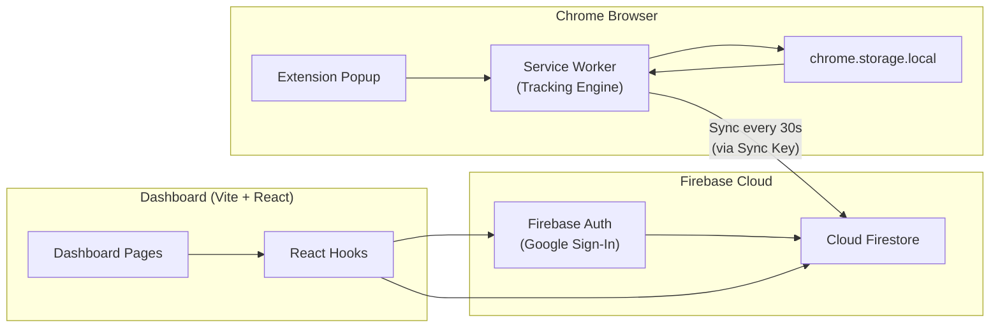

# FocusFlow 🎯

**FocusFlow** is a productivity tracking system made up of two parts:

1. **Chrome Extension** — tracks how much time you spend on each website in your browser
2. **Web Dashboard** — shows charts, goals, streaks, and deep analytics

Both sync via **Firebase (Google Auth + Firestore)** so your data stays consistent everywhere.

---

## 🚀 Quick Start — What's Hosted vs Local

| Part | Hosted online? | What you need to do |
|------|----------------|---------------------|
| **Dashboard** | ✅ **Yes** — already live on the web | Just open the URL in your browser. No `npm install` or local server needed. |
| **Chrome Extension** | ❌ **No** — runs locally in your browser | Load the `extension/` folder as an **unpacked** extension in Chrome. |

**Live Dashboard URL:** [https://focus-flow-two-orpin.vercel.app/](https://focus-flow-two-orpin.vercel.app/)

[](https://github.com/code-with-abhi-i5/FocusFlow/raw/main/releases/focusflow-extension.zip)

The extension is **not** published on the Chrome Web Store. Download the ZIP above (or build from source), unzip it, then load the `extension` folder in Chrome.

### How to get started (most users)

```
1. Download the extension
      Click "Download Extension ZIP" above → unzip the file

2. Load it in Chrome (one time)
      chrome://extensions/ → Developer mode ON → Load unpacked
      → select the unzipped extension/ folder

3. Open the hosted dashboard
      https://focus-flow-two-orpin.vercel.app/ → Sign in with Google

4. Connect them
      Copy Sync Key from dashboard sidebar
      → Extension Settings (⚙️) → paste Dashboard Sync Key → Save

5. Browse normally — tracking starts automatically
```

> **No build required** if you use the pre-built ZIP. Developers who change extension code should run `npm run build` inside `extension/` (see [Development Commands](#-development-commands)).

You do **not** need to run `npm run dev` for the dashboard unless you are developing or changing the dashboard code yourself.

---

## Table of Contents

- [Quick Start — What's Hosted vs Local](#-quick-start--whats-hosted-vs-local)
- [Features](#-features)
- [Tech Stack](#-tech-stack)
- [Project Structure](#-project-structure)
- [System Architecture](#-system-architecture)
- [Setup & Installation](#-setup--installation)
- [User Guide](#-user-guide)
- [Extension Features](#-extension-features)
- [Dashboard Pages](#-dashboard-pages)
- [How Data Sync Works](#-how-data-sync-works)
- [Development Commands](#-development-commands)
- [Firestore Security Rules](#-firestore-security-rules)
- [Troubleshooting](#-troubleshooting)

---

## ✨ Features

### Chrome Extension

| Feature | Description |
|---------|-------------|
| **Automatic Time Tracking** | Automatically counts time spent on the active tab |
| **Productivity Score** | Daily score (0–100) based on productive vs unproductive sites |
| **Domain Categories** | Classifies each site as *productive*, *unproductive*, or *neutral* |
| **Focus Mode** | Blocks distracting websites and shows a custom block page |
| **Pomodoro Timer** | 25 min work / 5 min break cycles with notifications |
| **Daily Goals** | Shows progress toward your target productive hours |
| **Streaks** | Tracks consecutive productive days |
| **Per-Site Limits** | Set a daily limit per site — auto-blocks when exceeded |
| **Social Media Limit** | Total daily social media time limit with alerts |
| **Idle Detection** | Pauses tracking when you are inactive |
| **AI Insights (Gemini)** | Personalized productivity tips based on your usage data |
| **Smart Alerts** | Chrome notifications for limits, streaks, and motivational quotes |
| **Weekly Stats** | This week vs last week comparison in the popup |

### Web Dashboard

| Feature | Description |
|---------|-------------|
| **Dashboard Overview** | Score, total time, top sites, heatmap, AI coach tips |
| **Deep Analytics** | 7/30 day charts — pie, trend, heatmap, top websites |
| **Goals & Achievements** | Set daily goals and unlock streak badges |
| **Settings** | Custom domain categories, data export, sync key |
| **Dark/Light Theme** | Full theme toggle across the dashboard |
| **Google Sign-In** | Secure login via Firebase Auth |

---

## 🛠 Tech Stack

### Chrome Extension

| Technology | Purpose |
|------------|---------|
| **Manifest V3** | Latest Chrome extension standard |
| **Vanilla JavaScript (ES Modules)** | Popup, options, and background scripts |
| **Rollup** | Bundles the service worker (required for Firebase imports) |
| **Firebase v12** | Auth and Firestore sync |
| **Chrome APIs** | `tabs`, `idle`, `alarms`, `storage`, `notifications`, `declarativeNetRequest`, `identity`, `webNavigation` |
| **Google Gemini API** | AI productivity insights |
| **Custom CSS** | Glassmorphic popup UI (Inter font) |

### Web Dashboard

| Technology | Purpose |
|------------|---------|
| **React 19** | UI framework |
| **TypeScript** | Type-safe code |
| **Vite 8** | Dev server and build tool |
| **Tailwind CSS v4** | Styling (`@tailwindcss/vite` plugin) |
| **React Router v7** | Page navigation |
| **Recharts** | Charts (pie, bar, line, heatmap) |
| **Framer Motion** | Animations |
| **Lucide React** | Icons |
| **Firebase v12** | Auth and real-time Firestore data |

### Backend / Cloud

| Service | Purpose |
|---------|---------|
| **Firebase Authentication** | Google Sign-In |
| **Cloud Firestore** | `users`, `timeEntries`, `goals`, `streaks`, `categories` collections |
| **Firestore Security Rules** | Ensures each user can only access their own data |

---

## 📁 Project Structure

```
FocusFlow/
├── extension/                    # Chrome Extension
│   ├── manifest.json             # Extension config & permissions
│   ├── background/
│   │   ├── service-worker.js     # Core tracking engine (source)
│   │   └── service-worker-bundle.js  # Rollup bundled output (loaded by Chrome)
│   ├── popup/
│   │   ├── popup.html            # Extension popup UI
│   │   ├── popup.css             # Glassmorphic styles
│   │   └── popup.js              # Popup logic
│   ├── options/
│   │   ├── options.html          # Settings page
│   │   └── options.js            # Settings logic
│   ├── blocked/
│   │   ├── blocked.html          # Focus Mode block page
│   │   ├── blocked.css
│   │   └── blocked.js
│   ├── content/
│   │   └── content.js            # Content script (page-level helpers)
│   ├── utils/
│   │   ├── tracker.js            # Tab time tracking logic
│   │   ├── storage.js            # chrome.storage.local wrapper
│   │   ├── sync.js               # Firestore sync engine
│   │   ├── categories.js         # Domain classification
│   │   ├── blocker.js            # Focus Mode website blocker
│   │   ├── idle.js               # Idle state detection
│   │   ├── alerts.js             # Chrome notifications
│   │   ├── ai.js                 # Gemini AI insights
│   │   └── firebase.js           # Firebase config & helpers
│   ├── icons/                    # Extension icons (16, 48, 128)
│   └── rollup.config.mjs         # Service worker bundler config
│
├── dashboard/                    # React Analytics Dashboard
│   ├── src/
│   │   ├── pages/                # Dashboard, Analytics, Goals, Settings, Login
│   │   ├── components/           # UI, charts, layout
│   │   ├── hooks/                # useTimeData, useGoals, useStreaks, useAnalytics
│   │   ├── contexts/             # AuthContext, ThemeContext
│   │   ├── services/
│   │   │   ├── firebase/         # Firestore services
│   │   │   └── aiCoach.ts        # Rule-based AI coach (dashboard)
│   │   └── types/                # TypeScript interfaces
│   ├── vite.config.ts
│   └── package.json
│
└── firestore.rules               # Firestore security rules
```

---

## 🏗 System Architecture



**Tracking flow:**

1. The service worker detects the active tab
2. Elapsed time is flushed every 10 seconds (`chrome.alarms`)
3. Tracking pauses when you go idle
4. Firestore sync runs every 30 seconds (if a Sync Key is set)
5. The dashboard reads data from Firestore in real time

---

## ⚡ Setup & Installation

### For end users (extension + hosted dashboard)

You only need **Chrome**. The dashboard is already hosted — no dashboard setup required.

**Option A — Download ZIP (recommended)**

1. **[Download Extension ZIP](https://github.com/code-with-abhi-i5/FocusFlow/raw/main/releases/focusflow-extension.zip)** — click to download
2. Unzip the file — you will get an `extension/` folder
3. Open `chrome://extensions/` → turn on **Developer mode** → **Load unpacked** → select that `extension/` folder
4. Pin FocusFlow to your toolbar

**Option B — Build from source**

```bash
cd extension
npm install
npm run build
```

Then load the `extension/` folder in Chrome the same way as above.

> The extension is a **local file** — it is not on the Chrome Web Store. The ZIP is pre-built and ready to load. No `npm` needed for Option A.

**Open the hosted dashboard**

Go to: **[https://focus-flow-two-orpin.vercel.app/](https://focus-flow-two-orpin.vercel.app/)**

Sign in with Google, copy your **Sync Key** from the sidebar, and paste it in Extension → Settings → **Dashboard Sync Key** → Save.

**Start using**

Click the extension icon to track time, use Focus Mode, Pomodoro, etc. Data syncs to the cloud and appears on the hosted dashboard automatically.

---

### For developers (local dashboard + Firebase setup)

Use this only if you want to run or modify the dashboard on your machine, or set up your own Firebase project.

#### Prerequisites

- **Google Chrome** (version 116+)
- **Node.js** (v18+ recommended)
- **Firebase account** ([console.firebase.google.com](https://console.firebase.google.com))
- *(Optional)* **Google Gemini API key** for AI insights ([aistudio.google.com](https://aistudio.google.com))

#### Step 1: Firebase Project Setup

1. Create a new project in the [Firebase Console](https://console.firebase.google.com)
2. Enable **Authentication** → turn on the **Google** provider
3. Create a **Cloud Firestore** database (production mode)
4. Copy your Firebase config values (Project Settings → Your apps → Web app)

**Extension config** — add values to `extension/utils/firebase.js`:

```javascript
const firebaseConfig = {
  apiKey: "YOUR_API_KEY",
  authDomain: "YOUR_PROJECT.firebaseapp.com",
  projectId: "YOUR_PROJECT_ID",
  storageBucket: "YOUR_PROJECT.appspot.com",
  messagingSenderId: "YOUR_SENDER_ID",
  appId: "YOUR_APP_ID"
};
```

**Dashboard config** — create a `dashboard/.env` file:

```env
VITE_FIREBASE_API_KEY=your_key
VITE_FIREBASE_AUTH_DOMAIN=your_auth_domain
VITE_FIREBASE_PROJECT_ID=your_project_id
VITE_FIREBASE_STORAGE_BUCKET=your_storage_bucket
VITE_FIREBASE_MESSAGING_SENDER_ID=your_sender_id
VITE_FIREBASE_APP_ID=your_app_id
```

5. Deploy **Firestore Security Rules** — use the [firestore.rules](firestore.rules) file (details below)

#### Step 2: Extension Build & Load

Same as the end-user steps above. After changing `firebase.js` or `service-worker.js`, run `npm run build` again and reload the extension in `chrome://extensions/`.

#### Step 3: Run the dashboard locally (optional)

Only needed for development — regular users should use the hosted URL instead.

```bash
cd dashboard
npm install
npm run dev
```

Open **http://localhost:5173** in your browser.

To build and deploy the dashboard yourself:

```bash
npm run build
npm run preview          # local preview of production build
firebase deploy --only hosting   # deploy to Firebase Hosting (see dashboard/firebase.json)
```

---

## 📖 User Guide

### First-Time Setup (~5 minutes)

```
1. Download & unzip extension
      https://github.com/code-with-abhi-i5/FocusFlow/raw/main/releases/focusflow-extension.zip

2. Chrome → chrome://extensions/ → Load unpacked → select extension/ folder

3. Open https://focus-flow-two-orpin.vercel.app/ → sign in with Google

4. Copy "Sync Key" from the dashboard sidebar

5. Extension → Settings (⚙️) → paste "Dashboard Sync Key" → Save

6. Start browsing — data syncs to the hosted dashboard automatically
```

> **Remember:** Dashboard is online. Extension = download ZIP → unzip → load in Chrome.

### Daily Usage

1. Open the **extension popup** (click the toolbar icon)
2. On the **Today** tab, view:
   - Productivity Score
   - Total tracked time
   - Top websites list
   - Daily goal progress
3. Start **Focus Mode** when you need deep work
4. Use **Pomodoro** for timed work sessions
5. Open the **hosted dashboard** ([focus-flow-two-orpin.vercel.app](https://focus-flow-two-orpin.vercel.app/)) or click the grid icon in the extension popup

### Connecting Extension ↔ Dashboard

| Step | Where | What to do |
|------|-------|------------|
| 1 | Hosted dashboard → Sidebar | Copy your **Sync Key** (this is your Firebase UID) |
| 2 | Extension → Options (⚙️) | Paste the Sync Key |
| 3 | Save | Data will start syncing to Firestore within 30 seconds |

> The extension tracks time locally even without a Sync Key. A Sync Key is required to see your data on the hosted dashboard.

### Enabling AI Insights

1. Get a free Gemini API key from [Google AI Studio](https://aistudio.google.com)
2. Extension → Options → paste your **Gemini API Key**
3. In the popup, click **"Get AI Insight ✨"**

---

## 🔌 Extension Features

### Popup (Toolbar Icon)

| Section | Description |
|---------|-------------|
| **Productivity Score Ring** | Today's score — percentage of productive time |
| **Tracked Time** | Total tracked time today |
| **Day Streak** | Number of consecutive productive days |
| **Daily Goal Bar** | Target productive hours vs actual |
| **Pomodoro Timer** | 25 min work → 5 min break → repeat |
| **Current Session** | Which site is being tracked right now (live) |
| **Today's Activity** | Top sites with time spent |
| **Focus Mode** | Block blocklisted sites for a set duration |
| **AI Insight** | Personalized tip from Gemini |
| **Stats Tab** | Weekly comparison and personal best streak |

### Options Page (Settings ⚙️)

| Setting | Description |
|---------|-------------|
| **Dashboard Sync Key** | Links the extension to the dashboard |
| **Gemini API Key** | Required for AI insights |
| **Notifications** | Toggle limit alerts on/off |
| **Idle Timeout** | Seconds of inactivity before tracking pauses (default: 60s) |
| **Theme** | Dark / Light |
| **Daily Productive Hours** | Goal target (default: 4 hours) |
| **Social Media Limit** | Max daily social media minutes |
| **Per-Site Limits** | Site-specific daily limits → auto-block |
| **Domain Categories** | Mark sites as productive/unproductive |
| **Focus Mode Blocklist** | Sites blocked during Focus Mode |

### Focus Mode

- Opening a blocklisted site shows a custom **blocked page**
- Redirects are handled via `chrome.declarativeNetRequest`
- Blocks are removed automatically when the timer ends
- Sites can also be temporarily unblocked

### Default Productive Sites (examples)

`github.com`, `stackoverflow.com`, `notion.so`, `figma.com`, `coursera.org`, `react.dev`, `chatgpt.com`, and many other dev/productivity tools.

### Default Unproductive Sites (examples)

`youtube.com`, `twitter.com`, `instagram.com`, `reddit.com`, `netflix.com`, `tiktok.com`, etc.

> Add or remove custom categories in Extension Options or Dashboard Settings.

---

## 📊 Dashboard Pages

### 🏠 Dashboard (`/`)

- Productivity score (large ring)
- Stat cards: total time, productive time, unproductive time, streak
- Top websites table
- Activity heatmap (last 7 days)
- AI Coach tips (rule-based, local)
- Goal progress card

### 📈 Analytics (`/analytics`)

- Select **7 days** or **30 days** range
- Productivity pie chart (productive / unproductive / neutral)
- Daily trend line chart
- Top websites bar chart
- Weekly heatmap
- Summary stats: average daily time, best day, etc.

### 🎯 Goals (`/goals`)

- Daily productive hours slider (1–16 hours)
- Social media limit slider (15–480 minutes)
- Streak badge with fire animation
- Achievement milestones:
  - 🔥 First Sparks (1 day)
  - ⭐ Focus Warrior (3 days)
  - 🏆 Productivity Ninja (7 days)
  - 🎯 Elite Focus Master (21 days)

### ⚙️ Settings (`/settings`)

- **Sync Key** display and copy button
- Manage custom domain categories (productive / unproductive / neutral)
- Notification preferences
- Idle timeout
- **Export data** as JSON

---

## 🔄 How Data Sync Works

```
Extension (local)                    Firestore (cloud)                Dashboard
─────────────────                    ─────────────────                ─────────
chrome.storage.local    ──sync──►    timeEntries/{syncKey_domain_date}
  ├── daily domain times             goals/{syncKey}
  ├── goals                          streaks/{syncKey}
  ├── streaks                        categories/{syncKey}
  └── settings                       users/{uid}
                                                          ◄──read──  React hooks (real-time)
```

| Collection | Data |
|------------|------|
| `timeEntries` | Per-domain daily time (milliseconds) |
| `goals` | Daily productive hours, social media limit |
| `streaks` | Current streak, longest streak, last active date |
| `categories` | Custom productive/unproductive domain lists |
| `users` | Profile info (email, name, photo) |

**Sync interval:** Every 30 seconds (extension background alarm)

**Sync key:** Your Firebase UID after dashboard login — links the extension and dashboard together

---

## 💻 Development Commands

### Extension

```bash
cd extension
npm install
npm run build          # Rollup bundle — generates service-worker-bundle.js
```

### Dashboard

```bash
cd dashboard
npm install
npm run dev            # Dev server → http://localhost:5173
npm run build          # Production build → dist/
npm run preview        # Production preview
npm run lint           # ESLint check
```

### Key Design Decisions

- **MV3 Heartbeat:** Service workers are ephemeral — `chrome.alarms` flushes tracking every 10s and syncs to Firestore every 30s
- **Rollup Bundle:** Firebase ES modules cannot be loaded directly in the service worker — Rollup bundles them
- **Glassmorphic UI:** Custom CSS variables, dark slate theme, radial gradients
- **Dual AI:** Gemini API in the extension (live tips), local rule-based coach in the dashboard

---

## 🔒 Firestore Security Rules

Deploy the `firestore.rules` file in the Firebase Console:

```bash
# Via Firebase CLI (if configured)
firebase deploy --only firestore:rules
```

Or paste manually in Firebase Console → Firestore → Rules tab.

The rules ensure:

- Only authenticated users can read/write their own data
- Every document's `uid` field must match the authenticated user
- No user can access another user's data

---

## ❓ Troubleshooting

| Problem | Solution |
|---------|----------|
| Extension data not showing in dashboard | Check your Sync Key — copy from dashboard sidebar and paste in Extension Options |
| Tracking not working | Is the extension enabled? Check `chrome://extensions/`. Make sure you are on an active tab and not idle |
| AI Insight error | Set your Gemini API key in Options. The key must be valid |
| Focus Mode not blocking | Add domains to the blocklist. Enter domains without `www.` (e.g. `youtube.com`) |
| Service worker changes not reflected | Run `cd extension && npm run build`, then reload the extension |
| Firebase auth failing | Verify the same Firebase project config is used in both extension and dashboard |
| Notifications not appearing | Allow Chrome notification permissions. Turn on Notifications in Options |

---

## 📄 License

This project is for personal/educational use. Customize and extend as needed.

---

**FocusFlow** — *Track smarter. Focus deeper. Achieve more.* 🚀
